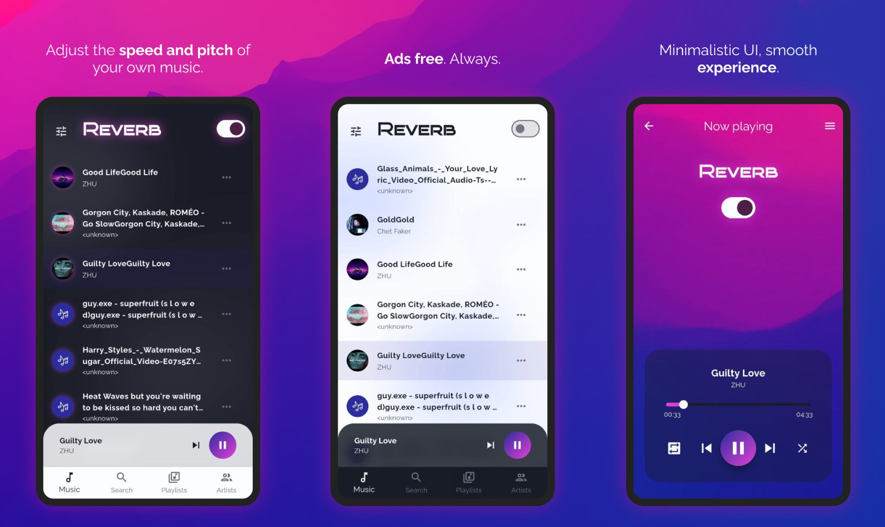

# 🎼 Reverb
### Your music, slowed down.

Reverb is a local music player that allows you to enable **"slowed + reverb"** or **"sped up"** (or famously - **Nightcore**) playback modes. Adjust the speed and pitch to your liking, and experience your music in another light. 

## ✨ Features
- Playing music from library
- Changing the pitch and speed of music, for **"reverb"** or **"nightcore"** effect
- Search songs, sort by artist or playlist
- Playlist manipulation
- Foreground notification
- Seek audio

##### 🛠 Still in the development!
- Manipulate current playlist queue
- Theme toggle with reverb
- Platform-native echo effect
- Multiple languages support
- UI haul

## 🐞 Bugs
[ ] Theme changing with reverb switch

## Screenshots

## 💻 Development Commands
Generate translations: `dart run slang`

##### Managing iOS setup
 
https://pub.dev/packages/just_audio
https://pub.dev/packages/on_audio_query_forked
