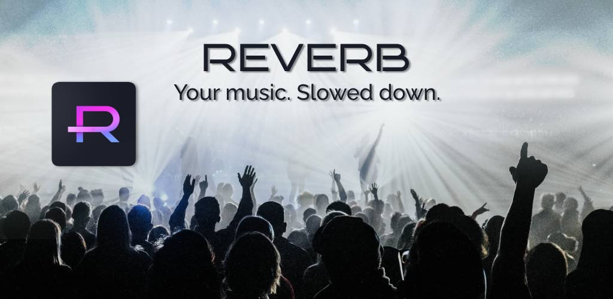

# 🎼 Reverb
### Your music, slowed down.

Reverb is a local music player that allows you to enable **"slowed + reverb"** or **"sped up"** (or famously - **Nightcore**) playback modes. Adjust the speed and pitch to your liking, and experience your music in another light. 

### Why Reverb?
> Reverb is an application with an idea to improve the music listening experience. With the ongoing rise in popularity of the **slowed-down/reverb** trope of song remixes, allowing the users to switch themselves between the standard and the slowed-down versions of the song would bring a new sort of enjoyment.

> Exploring music as a form of art should be easily accessible even to people who are not as technologically oriented. Therefore, intuitive interface design should be able to allow easily managing main parameters that would influence said experience (such as speed, bass, reverb, pitch change).

## ✨ Features
- Playing music from library
- Changing the pitch and speed of music, for **"reverb"** or **"nightcore"** effect
- Search songs, sort by artist or playlist
- Playlist and queue manipulation
- Foreground notification
- Multiple languages support

##### 🛠 Future development plans
- Platform-native echo effect

## 🐞 Bugs
Nothing for now... :) 

## Screenshots

## 💻 Development Commands
Generate translations: `dart run slang`

#### 🍎 Managing iOS setup
> Currently, the iOS version does not work, due to external plugin problems. As I am developing this app purely for **learning reasons**, with plans to publish it on **Play Store**, the priority for fixing the iOS version is currently low. Thank you for understanding! :)  
 
https://pub.dev/packages/just_audio
https://pub.dev/packages/on_audio_query_forked
